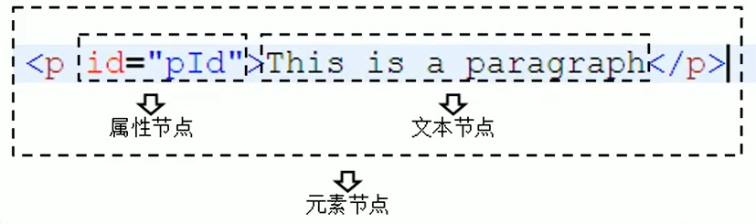

#### DOM简介
##### 节点
Node——构成HTML文档的最基本单元，常用节点的分类
* <font color="	#8B7500">文档节点</font>：整个HTML文档
浏览器为我们提供了文档节点对象（document），该对象时window属性，可以在页面中直接使用，文档节点代表整个网页
* <font color="	#8B7500">元素节点</font>：HTML文档中的HTML标签
* <font color="	#8B7500">属性节点</font>：HTML标签的属性
* <font color="	#8B7500">文本节点</font>：HTML标签中的内容

* <font color="#8b7500">节点属性</font>


##### 事件
事件是用户和浏览器之间的交互行为，比如点击按钮，移动鼠标，关闭窗口等等。

```
<button type="button" id="btn">我是一个按钮</button>
<script type="text/javascript">
	var btn = document.getElementById("btn");
	btn.onclick = function(){
		alert("我是按钮");
	}
</script>		
 ```
##### 文档的加载
浏览器加载页面时，是按照自上而下的顺序，读取一行运行一行，如果将script标签写在页面上面，在执行时，页面还没有加载，所以将js代码写在下面（body结束表结束前）或者采用外联式或者使用window绑定一个onload事件（onload事件会在整个页面加载完成后才触发，可以确保我们的代码执行时所有DOM对象已经加载）
