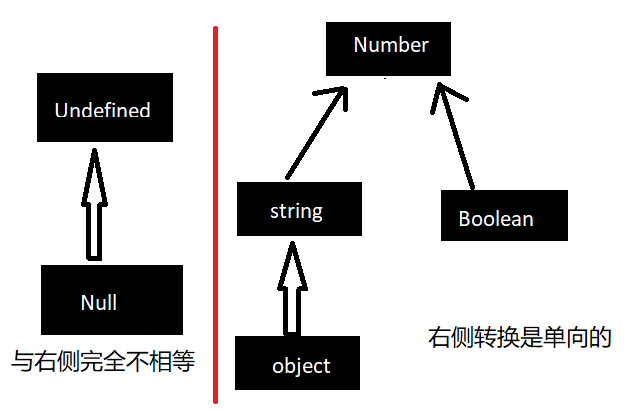
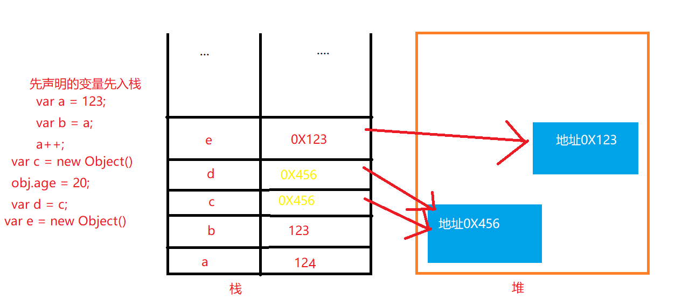

### javascript数据类型
* 基本数据类型
字符串（String）、数字 (Number)、布尔 (Boolean)、对空（Null）、未定义（Undefined）、Symbol。Symbol是ES6引入的新的原始数据类型，表示独一无二的值
* 引用数据类型
对象 (Object)、数组 (Array)、函数 (Function)，数组返回的也是object数据类型
#### 字符串数据类型 string
* 字符串的特性
是由0个或多个16位的Unicode字符组成，用单引号或者双引号包裹，但引号和双引号不能混合使用，**放在引号中的都是字符串，即使引号内没有任何东西或者是空格，都是合法字符串**
* 使用`.length`获取字符串的长度  
length计算长度的时候会将空格计算在内，**这个只能用于简单的判断，无法真正的统计字符的个数，因为中文一个字符表示两个字节，英文一个字符表示一个字节，所以想获取中文字符串的长度，需要对字符串进行判断或者过滤（可以使用Unicode字符区间进行过滤）**
* 字符串一旦被创建，无法被修改，只能被销毁
若要销毁改变一个字符串，只需要用一个包含新值得字符串来覆盖填充原变量字符串。
    ```
    //字符串创建的原理；
    var str1="12345";//把"12345"这个字符串赋值给str1这个变量；
    str1="1234";//把"1234"这个字符串赋值给str1这个变量；
    /*并不是把"12345"修改为"1234"然后赋值给str1*/
    ```
* 字符串的转义
同HTML，许多字符无法在文档中直接显示出来，需要用\\转义。
* 其他数据类型向字符串数据类型的转换 
通常使用toString()方法和String()方法来将其他的数据类型转换为字符串数据类型。
    * toString()
    把其他数据类型转化为字符串数据类型，主要用于转换Number/Boolean/String/Object。参数为类型数值基数，默认为十进制，当需要转换为2/8/16进制时可以填写，否则不需要填写。
        ```
        var num = 100;
        console.log(num, typeof num);//100 number
        var str1 = num.toString();
        console.log(str1, typeof str1);//100 string
        //因为需要转换的是数字，所以可以添加参数实现进制转换后的字符串
        var str2 = num.toString(16)//64 string 
        console.log(str2, typeof str2);
        ```
    * String()
    null和undefined没有toSting()方法，所以转换的时候必须用String()函数。
        ```
       var textNull = null;
       console.log(textNull, typeof textNull); //null object
       var textNullString = String(textNull);
       console.log(textNullString, typeof textNullString);//null String
       var textUndefine;
       console.log(textUndefine typeof textUndefine);//undefine undefine
       console.log(String(textUndefine), typeof String(textUndefine));//undefine string
       ```
        **注：可以写`toString(number)`这种形式，但是不建议，但是坚决不能写成`number.String()`这样会报错！**
    * 快速转换为字符串
    对于任何数据类型的变量(不只是基本数据类型，引用数据类型和数组等也可以），可以将其与`""`相加，就可以将其变成字符串数据类型
        ```
        var numVal=2;
        var boolVal=false;
        var nullVal=null;
        var undefinedVal=undefined;
        var numValPlus=numVal+""; 
        var boolValPlus=boolVal+"";
        var nullPlus=nullVal+"";
        var undefinedPlus=undefinedVal+"";
        console.log(numValPlus,typeof numValPlus);
        console.log(boolValPlus,typeof boolValPlus);
        console.log(nullPlus,typeof nullPlus);
        console.log(undefinedPlus,typeof undefinedPlus);
        var array = [1,2,3,4];
        console.log(array, typeof array);//[1,2,3,4] object
        console.log(array+"", typeof array);//1,2,3,4 object
        console.log(array+"", typeof array+"");//1,2,3,4 object，因为typeof只运算前面一个，算符优先级太高，typeof (array + "") 会变成string
        var arrayPlus = array + "";
        console.log(arrayPlus, typeof arrayPlus);//1,2,3,4 string
        ```
    * eval() 计算数字字符串表达式的和值，并以数值的形式返回，含有非数字的字符串表达式，调用eval()方法时会报错。
        ```
        var str = "1+2+3+4";
        console.log(str, typeof str);//1+2+3+4, string
        var num = eval(str);
        console.log(num, typeof num);//10 number;
        var str2 = "a+b+C+1";
        var num2 = eval(str2);//报错"a is not defined",将a改成非数字的其他字符，同样会报错
        ```
* 字符串快速转化为数字
字符串类型的数字，前面添加`+`，可以迅速将其转化为Number数据类型，实则隐式调用了Number()
     ```
    console.log(+"3.14", typeof (+"3.14"));//3.14 Number
    console.log(+"3.14abc", typeof (+"3.14"));//NaN Number
    console.log(+"abc3.14", typeof (+"3.14"));//NaN Number
    console.log(parseFloat("3.14abc"), typeof(parseFloat("3.14abc")));//3.14 Number
    console.log(parseFloat("a3.14abc"), typeof(parseFloat("3.14abc")));//3.14 Number
    ```
#### 数字数据类型Number
* 数字类型
数字类型包括：正数、负数、0（+0，-0，0）、小数以及特殊数字NaN（Not a Number)
* 数值范围
最小值：`Number.MIN_VALUE`，最大值：`Number.MAX_VALUE`，正无穷：`infinity/Number.POSITIVE_INFINITY`，负无穷：`-infinity/Number.NEGATIVE_INFINITY`  
检测方法：isFinite，如果超出为true 反之为false。
* NaN
非数值，但是属于number数据类型，任何涉及NaN的操作都将返回NaN，NaN与任何数字都不相等，包括它自己
    ```
    console.log(NaN === NaN);//false
    console.log(isNaN(25-"yang"));//true
    console.log(isNaN(25));//false
    console.log(isNaN(Infinity));//false
    ```
* string转换数值转换的五种方法
    * Number()转换，但是只要不是纯数字类型的其他数据类型，都只能转换为NaN
        ```
        console.log(Number("123456"),typeof (Number("123456)));//123456 Number
        console.log(Number("123456a"),typeof (Number("123456a")));//NaN Number
        ```
    * parseInt()方法，Number()的升级版
        含有非数字字符的也可以进行转换，忽略前导空格，从前向后转换，只要有一位数字就能转换成非NaN的数字，可以传入参数指定当前字符串的进制状态，转化后统一为10进制数，默认参数为10**遇到第一个非数字符号后直接退出转换。**
        ```
        console.log(parseInt("100"));//100
        console.log(parseInt("070"));//56 首位字符为0，则按照8进制数值进行处理
        console.log(parseInt("0x70"));//112 0x表示16进制，则按照16进制数值进行处理
        console.log(parseInt("AF"));//NaN 因为默认源字符串是10进制字符串
        console.log(parseInt("100.258"));//100
        console.log(parseInt("10a0.258"));//10
        console.log(parseInt("100", 2));//4
        console.log(parseInt("100", 16));//256
        ```
    * parseFloat()方法，是parseInt()的升级版，可以转换浮点数，同样忽略前导0和前导空格，但是不可以传递其他参数，设定源字符串的进制情况。
        ```
        console.log(parseFloat("100.258"));//100.258
        console.log(parseFloat("100.258avf"));//100.258
        ```
    * 后面-0法，隐式调用Number()方法
        ```
        console.log("100"-0, typeof("100"-0));//100 number
        console.log("100"-1, typeof("100"-1));//99 number 先转换为number类型，再执行减一操作
        ```
    * 前面+号法，使用单目加法运算符，可以实现字符串转换为数字（string数据类型时讲过）
        ```
        console.log(+"3.14", typeof (+"3.14"));//3.14 Number
        console.log(+"3.14abc", typeof (+"3.14"));//NaN Number
        console.log(+"abc3.14", typeof (+"3.14"));//NaN Number
        console.log(parseFloat("3.14abc"), typeof(parseFloat("3.14abc")));//3.14 Number
        console.log(parseFloat("a3.14abc"), typeof(parseFloat("3.14abc")));//3.14 Number
        ```
* 其他数据类型转化为number数据类型
    * Boolean转换为数值时
        * true --> 1
        * false --> 0
    * null转换0
    * undefined转换为NaN
    * object
    先调用valueOf()获得返回值，然后依照前面的规则转换返回的值，如果转换的结果是NaN，则调用对应的toString方法，然后再次依照前面的规则转换返回的字符串值
#### 布尔数据类型Boolean
* 布尔类型值
布尔类型只有true和false两种值，true为真，false为假。**false为布尔值，但是False为标识符**
* 布尔类型的特性
    * true不一定为1，false不一定为0（同C/C++区分开）
    * 使用 boolean() 进行转换
    任何数据类型的值调用 Boolean() 函数，都会返回一个 Boolean 值；也可以用 (!/!! 来转换）**主要是根据Boolean中的值进行判断，如果有运算先进行运算，再判断**
        * 转化为true的
            + Boolean的true值
            + 任何非空字符串
            + 任何非0数值
            + 对象
        * 转化为false
            + Boolean的false值
            + 空字符串
            + null
            + undefined
            + 0或者NaN
        ```
        console.log(Boolean(0));//false
        console.log(Boolean(123));//true
        console.log(Boolean(""));//false
        console.log(Boolean(" "));true 空格也是字符
        console.log(Boolean(NaN));//false
        console.log(Boolean({}), typeof({}));//true object
        console.log(Boolean(function(){}), typeof(function(){}));//true function
        console.log(55*"asd",Boolean(55*"asd"), typeof(55*"asd"));// NaN false number
        ```
    * !取反
    `!`是取反的意思，现将其他数据类型转换为布尔类型，然后再取反
        ```
        console.log(!0)//true
        console.log(!!0)//false
        ```
    * 逻辑运算数据类型转换方向
    
    * 各种数据类型的判断比较

    |类型A|类型B|比较时候的运算原理|说明|
    |---|---|---|---|
    |object|object|比较的是内存地址，两个对象内存地址肯定不相同|不相等|
    |object|string|先将对象转换为字符串，然后字符串之间进行比较|可能相等，但是一般没有意义|
    |object|Boolean|两边都转化为数字（false为0，true为1）；object类型调用toString()方法，转化为字符串，字符串再调用Number()转化为数字，再比较数字|如果两边的数字相等，则等，反之不等|
    |object|Number|bject类型调用toString()方法，转化为字符串，字符串再调用Number()转化为数字，然后比较数字||
    |Number|Boolean|先将Boolean类型转化为数字（0/1），然后比较数字||
    |Number|string|先将字符串转化为Number类型，再比较数字||
    |Boolean|string|两边都是先转化为数字，再比较数字||
    |null|undefined|一直为true，因为undefined派生自null||
    |null/undefined|其他所有类型|恒为false，因为null和undefined没有toString()方法|

#### Object数据类型
一组数据和功能的集合，单个类型的数据无法产生关联性，Object可以实现数据之间的关联，对象的属性值可以是任何数据类型包括object
* 声明语法 
    ```
    var o = new Object()//"()"可以省略，使用new关键字调用的都是构造函数，是构造函数constructor
    var o2 = {
        name: "tom",
        sex: "男",
        test: {name: "jerry"}//对象的属性值也可以是对象
    };//注意：每个属性后面跟一个属性值，属性之间用","隔开，跟java和C++不同
    ```

* 对象的属性和属性值的增删改查
属性和属性值是对应的，向对象中添加属性，如果读取对象中没有的属性，不会报错，而是返回undefined，**不同于输出没有定义的变量会报错`xx is not defined`**。属性名（字符串）不遵守标识符规范，什么名字都可以用，但是不建议，当使用纯数字或者特殊的属性名时**添加和读取**都得使用`对象["属性名"] = 属性值`的方式（算符优先"."、"[]"、"new"三者为最）
    ```
    var o = new Object();
    var o2 = new Object();
    //添加属性
    o.name = "张三";
    o.age = 18;
    o.value = o2;
    //读取属性
    //读取的语法：对象名称.对象属性
    console.log(o.age);//18
    console.log(o.sex);//undefined
    //更改属性值
    o.name = "lisi";
    //删除属性
    delete o.name;//如果删除成功则返回true，否则返回false，如果没有该属性也会返回true
    conso.log(delete o.sex);//true
    console.log(o.name);//undefined
    o["var"] = "12344";
    o["123"] = "zbisfsi";//可以利用这种方式来实现传参
    var str = "123";
    console.log(o[str]);//zbisfsi
* in 运算符检查对象中是否含有某个属性，如果有则返回true，没有则返回false，语法：`"属性名" in 对象`
    ```
    var o = {
        name: "zhangsan",
        age: 13,
        class: 7
    };
    console.log("age" in o);//true
    console.log("grade" in o);//false
    //使用函数作为对象的属性值(对象的方法)
    var obj = new Object();
    obj.name = "刘德华";
    obj.age = 18;
    obj.sayName = function(){
        console.log("喊出我的名字"+obj.name)
    };
    obj.sayName();
    ```
* 枚举对象中的属性
使用`for ... in`语句来枚举对象中的所有属性。<font color="red">它遍历的是对象可以遍历的属性，会跳过不可遍历的属性。它不仅遍历对象自身的属性，还会遍历继承的属性</font>。**如果想只遍历自身的属性，可以结合hasOwnProperty方法判断一下，某个属性为对象自身属性**
    ```
    for(var n in obj){
        //每次执行时会将对象中的属性名赋值给变量n
        console.log("属性名"+n);
        //挨个打印属性值
        console.log("属性值:"+obj[n]);
    }
    ```
* object数据类型的公共方法
在ECMAScript中，Object是所有对象的基础，因此所有对象都具有这些基本的属性和方法；方法的具体原理，后面数据类型和原型链中具体说；BOM/DOM中的对象，都是属于宿主对象，因为他们是由宿主实现提供和定义的，但是ECMAScript不负责定义宿主对象，因此宿主对象可能会也可能不会继承Object
    * constructor：保存用于创建当前对象的函数，构造函数就是Object()
    * HasOwnProperty(propertyName) 检测给定输定在当前对象实例中是否存在（而不是实例的原型中）
    * isPrototypeOf(object) ：检测传入的对象是否是另一个对象的原型（而不是在实例中）；
    * propertyIsEnumerable(propertyName)；检测给定属性是否能用for-in语句每句来枚举；
    * toLocaleString() 返回对象的字符串表示，该字符串与执行环境的地区对应；
    * toString() 返回对象的字符串表示
    * valueOf() 返回对象的字符串，数值或布尔值表示；通常与toString()的值相同；
* Object.keys查看一个对象本身的所有属性
    ```
    var obj = {
        key1: 1,
        key2: 2
    };
    Object.keys(obj);//['key1', 'key2']
    ```
* with 语句
作用是操作同一个对象的多个属性，提供书写的方便。<font color="red">如果with区块内部有变量赋值操作，必须是当前对象已经存在的属性，否则会创建当前作用域的全局变量</font>。原因是，with语句没有改变作用域的能力，他的内部依然是当前作用域，所以造成绑定对象不明确的问题。**可以使用一个临时变量来代替with，解决此问题**
    ```
	var p1 = 10;
	var obj = {
		p1: 5,
	};
	with(obj){
		p1 = 6;
		p2 = 7;
	}
	console.log(obj.p1);//7
	//with语句没有改变作用域的能力，他的内部依然是当前作用域，所以直接对一个变量赋值会造成创建一个全局变量
	console.log(obj.p2);//undefined
	console.log(p2);//7 创建了一个全局变量p2
	console.log("=======")
	var obj1 = {
		obj2: {
			obj3 :{
				p1: 1,
				p2: 2
			}
		}
	};
	console.log(obj1.obj2.obj3.p1 + obj1.obj2.obj3.p2);//3
	with(obj1.obj2.obj3){
		//不建议使用
		console.log(p1 + p2);//3
	}
	//建议使用
	var temp = obj1.obj2.obj3;
	console.log(temp.p1 + temp.p2);3
    ```
#### Null数据类型和Undefined数据类型
* 属性值
null和undefined都只有一个属性值，分别是null和undefined（名称即类型值） **undefined派生自null，故判等时二者恒等** 
    ```
    var nullVal = null;
    console.log(nullVal, typeof nullVal);//null object null是object的派生数据类型
    console.log(typeof typeof nullVal);//string typeof返回值是string数据类型的
    var undefinedVal;
    console.log(undefinedVal, typeof undefinedVal);//undefined undefined
    console.log(nullVal == undefinedVal);//true "=="比较是否相等(不是同一类型的先转换为同一类型再比较)
    console.log(nullVall === undefinedVal);//false "==="不是同一类型直接false
    ```
* 区别
    * null表示空对象指针（所以返回object类型），undefined表示未定义
    * doucment.getElementById()没有找到HTML元素时会返回null
    * 没有找到对象的属性，也是undefined（理解为没有定义该对象的该属性）此时不会报错，** 但是没有找到基本数据类型时会报错`xxx is not defined`
    * function的默认返回值是undefined（函数如果必须有返回值，但是计算不出来，就返回null，语法规范）
    * 未初始化都是undefined的类型
    * null转换为数字为0，undefined转换为数字是NaN
    * 调用函数时，应该提供的参数没有提供，则该参数为undefined

    ```
    var obj = {
        name: "zhangsan",
        age: 18
    };
    console.log(obj.sex)//undefined
    console.log(sex)//sex is not defined
    function method() {
        return;
    }
    var result = menthod();
    console.log(result);//undefined
    console.log(document.getElementById("diva"));//没有找到id为diva的元素返回null
    ```
#### Symbol数据类型
Symbol是JavaScript的**原始数据类型**，Symbol的实例是**唯一且不可改变的**，可以作为对象属性标识符使用，是ES6新数据类型
* Symbol的产生意义
ES5的对象名都是字符串，很容易造成属性名冲突，ES6引入Symbol可以保证属性名独一无二，从根本上有效的解决属性名冲突问题
* 创建Symbol类型的数据变量
Symbol值通过Symbol()函数生成
    ```
    let aloneVal = Symbol();//生成Symbol值
    console.log(aloneVal, typeof aloneVal);//Symbol() symbol
    ```
**注：Symbol函数前面不能用new命令，因为Symbol是原始数据类型，不是对象，故而Symbol值也不能添加属性**
* Symbol的参数
Symbol的参数仅仅是为了在控制台输出使识别区分的，没有其他作用，如果不设参数，则在控制台默认输出Symbol()，**即Symbol函数的参数只是对当前Symbol值的描述，因此相同参数的Symbol函数的返回值不相等，除相同变量，其他和谁都不等**（NaN和谁都不等）
    ```
    console.log(Symbol("nuw") == Symbol("nuw"));//false
    console.log(Symbol("") == Symbol(""));//false
    console.log(Symbol() == Symbol());//false   连自己都不等于自己，类似NaN
    const foo = Symbol();
    const bar = Symbol();
    const symbolVal = Symbol("11");
    console.log(typeof foo , typeof bar);//symbol symbol
    console.log(typeof foo === "symbol");//true
    console.log(typeof bar === "symbol");//true
    console.log(bar === bar);//true 当然如果用变量储存，俩个变量是相等的，但这并不说明2个相同Symbol值是相同的，但是NaN仍然不等
    console.log(bar === foo);//false
    ```
* Symbol值不能参与运算，会报错
Symbol值不能与其他类型的值进行运算，会报错！但是可以显式转为字符串/布尔值，但是不能转为数值。

#### 基本数据类型和引用数据类型的内存存储方式
* 基本数据类型的变量和值都是保存到**栈内存**中
基本数据类型的值保存在栈内存中，值和值之间是相对独立的，改变一个值，不会影响其他值

* 引用数据类型的变量和值都是保存到**堆内存**中
对象保存在堆内存中，每new一个新对象，就在堆内存中开辟一块新的内存空间，对象名称（变量名）保存在栈中，**变量的表面值为所创建对象的内存地址**


* 判等比较
基本数据类型判断是否相等，是判断变量值是否相等。引用数据类型判等是根据二者的变量的表面值是否相等（即判断内存地址是否相等），相等引用数据类型变量，可以通过任意一个变量来改变对象的属性或者属性值；有相同属性或者属性值得变量只要内存地址不同，就不相等。
    ```
    var obj1 = new Object();
    var obj2 = obj1;
    obj2.name = "xiaoming"//同时也可以用obj1来访问name属性，因为二者内存地址相同
    var obj3 = new Object();
    obj3.name = "xiaoming";
    console.log(obj1 === obj2)//true 二者内存地址相同
    console.log(obj2 == obj3)//false 尽管二者有相同的属性和属性值，但是内存地址不相同
    obj2 = null;//obj2与堆中内存单元的链接断开，不能再通过obj2来访问name属性，但是不影响obj1的正常访问
    console.log(obj2, typeof obj2);//null null
    console.log(obj1, typeof obj1);//{name: "xiaoming"} object
    ```
    


