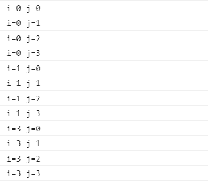

### 部分运算符详解
由于JS的运算符同C++和java有很多的类似之处，所以这个文档着重介绍部分运算符
#### 标签（label）
JavaScript语言支持语句前面有定位符（标签），用于跳转到程序的任意位置。<font color="red">标签可以是任意的标识符，单不能是保留字，语句部分可以是任意语句</font>。可以通过label标签和continue/break在多层循环的时候控制外层循环。
* 语法：
    ```
    label:
        语句
    ```
* 语句常和`break`语句和`continue`语句来配合使用，跳出特定循环后到指定位置
    ```
    outerloop:
		for (var i = 0; i < 10; i++)
		{
			innerloop:
			for (var j = 0; j < 10; j++)
			{
			    if (j > 3)
			    {
			        break;
		        }
		        if (i == 2)
		        {
			        break innerloop;
		        }
			    if (i == 4)
		        {
		            break outerloop;
		        }
		        console.log("i=" + i + " j=" + j + " ");
		    }
		}
    ```
    结果为:
    
    ```
	top:
	    for (var i = 0; i < 3; i++){
			for (var j = 0; j < 3; j++){
				if (i === 1 && j === 1) continue top;
				console.log('i=' + i + ', j=' + j);
			}
		}
	//到continue后面有标签时满足条件后会跳转过当前循环，直接进入下一层外部循环，当没有标签时只会跳出当前内层循环

	//跳转到top时		不跳转到top时					
	// i=0, j=0			i=0, j=0
	// i=0, j=1			i=0, j=1
	// i=0, j=2			i=0, j=2
	// i=1, j=0			i=1, j=0
	// i=2, j=0			i=1, j=2
	// i=2, j=1			i=2, j=0
	// i=2, j=2			i=2, j=1
	//					i=2, j=2
    ```

#### 三元运算符?:
语法为:`(条件)? 表达式1: 表达式2`
* 例子如下
    ```
    var myVar;
    console.log(
        myVar?
        "myVar has a value":
        "myVar dose not have a value"
    )
    //输出为：myVar dose not have a value
    //等同于以下代码
    if(myVar){
        console.log("myVar has a value");
    }else {
        console.log("myVar dose not have a value")
    }
    ```
#### 比较运算符
* 如果两个运算子都是元素数据类型，则是先转化为数字后再比较
<font color="red">NaN与任何值比较都会返回false 包括它自己</font>
* 如果运算子中有复杂数据类型，则先调用valueof方法转化，如果返回的还是对象则调用toString方法
	```
	var x = [2];
	x > '11' // true
	// 等同于 [2].valueOf().toString() > '11'
	// 即 '2' > '11'

	x.valueOf = function () { return '1' };
	x > '11' // false
	// 等同于 [2].valueOf() > '11'
	// 即 '1' > '11'
	```
#### void运算符
void运算符的作用是执行一个表达式，然后不返回任何值，或者说返回undefined。<font color="red">主要用于阻止浏览器的默认行为，比如超链接的跳转，表单的提交等</font>
	```
	<script>
	function f() {
	console.log('Hello World');
	}
	</script>
	<a href="http://example.com" onclick="f(); return false;">点击</a>
	//可以改写为
	<a href="javascript: void(f())">文字</a>
	//阻止表单的提交
	<a href="javascript: void(document.form.submit())">
	提交
	</a>
	```
